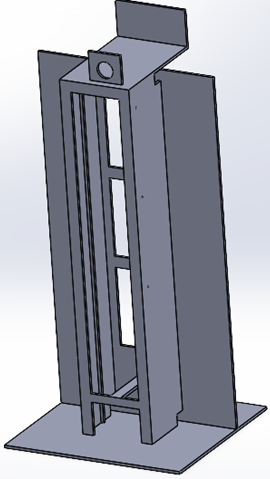
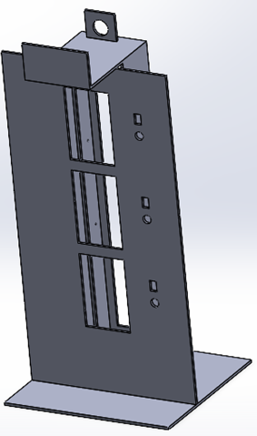
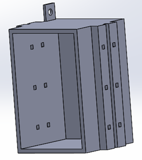

# 3D SolidWorks Designs

## Overview
This document showcases the 3D SolidWorks designs used in the Mini Elevator System.

## Chassis Design
Below is the 3D model of the chassis:

This project includes a [SolidWorks manual](mechanical/chassis.PDF) for the mechanical design.
## Cabin Design
Below is the 3D model of the cabin:

This project includes a [SolidWorks manual](mechanical/cabine.PDF) for the mechanical design.
## Additional Components
- **Pulleys**: Designed to support the movement of the elevator.
- **Frame**: Provides structural support to the system.

## Design Considerations
- **Material Selection**: Aluminum was chosen for its strength-to-weight ratio.
- **Precision**: Tolerances were maintained to ensure smooth operation.