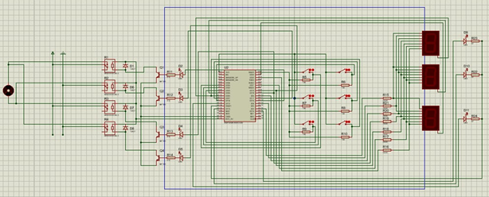
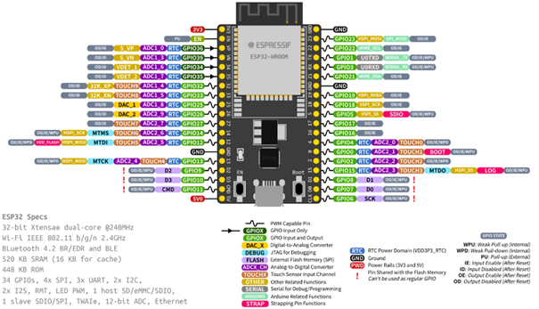

# Hardware Design: PCB Diagram

## Overview
This document provides the details of the PCB design used in the Mini Elevator System.

## PCB Diagram
Below is the diagram of the PCB used in the project:

## Components
- **Microcontroller**: Esp 32 
- **Power Supply**: 5V Regulator

 

## Design Considerations
- **Trace Width**: Ensured to handle the current required by the motors.
- **Component Placement**: Arranged to minimize noise and interference.
